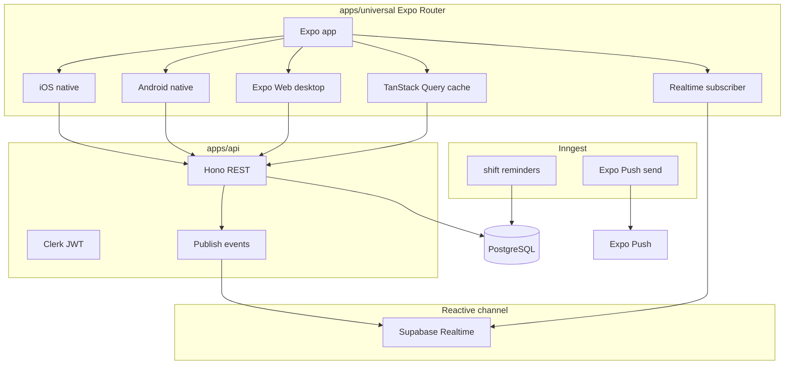

# TheOneSchedule — implementation plan

## Decisions locked

| Area | Choice | Implication |
|------|--------|-------------|
| Client | **Expo (React Native) + Expo Router** with **web** target | One TS codebase: App Store / Play via **EAS Build**; desktop via **Expo Web**; file-based routes everywhere |
| Reactive UX | **TanStack Query + live subscriptions (MVP)** | Schedules and tasks update without manual refresh when a manager publishes or tasks change |
| Realtime transport | **Supabase Realtime** on **Supabase Postgres** | Prisma targets Supabase DB; RLS per org; Hono writes, clients subscribe for live reads |
| Auth | **Clerk** (orgs, invites; `@clerk/clerk-expo` + web) | JWT verification in Hono; org ↔ `Organization` via webhooks |
| API | **Hono** on Node | REST; emits realtime events after successful mutations |
| Data | **Supabase PostgreSQL** + **Prisma** in `packages/db` | UTC storage; Realtime enabled on shift/task tables; location TZ in `packages/shared` |
| Jobs | **Inngest** | 24h shift reminders, push fan-out on publish |
| Push | **expo-notifications** + **Expo Push API** (EAS) | Primary worker alerts; web uses in-app toast/badge via reactive layer |

**Supersedes prior Capacitor plan:** manager v1 uses **select slot → form** (and optional `@hello-pangea/dnd` on Expo Web), not FullCalendar-in-WebView.

Repo state: [plan.plan.md](s:/Dev-Apps/TheOneSchedule/plan.plan.md) + minimal nested README. Scaffold at **workspace root** `s:\Dev-Apps\TheOneSchedule`.



---

## Reactive architecture

**Goal:** employees see new shifts within seconds of **Publish**; managers see assignment/task checkoffs update live on team views (MVP: employee schedule + task list).

**Client (`packages/shared` + `apps/universal`)**

- **TanStack Query** (`@tanstack/react-query`) for all server state; query keys: `['org', orgId, 'shifts', weekStart]`, `['org', orgId, 'my-shifts']`, `['org', orgId, 'tasks']`.
- **Optimistic updates** for task checkoff (rollback on error).
- **`useOrgRealtime(orgId)`** hook: subscribes once per session; on event → targeted `queryClient.invalidateQueries` (avoid refetch-everything).
- **Stale times:** short (30–60s) for schedule; rely on realtime for freshness; pull-to-refresh as fallback.

**Server + channel (locked: Supabase Realtime)**

- Postgres hosted on **Supabase**; Prisma migrations against `DATABASE_URL` (direct connection for migrate, pooler for runtime).
- **RLS** on `Shift`, `ShiftAssignment`, `TaskAssignment` (and related): policies keyed by `organization_id` matching Clerk org id claim or membership lookup table exposed to Supabase auth — use **Clerk JWT template** or sync `auth.users` via webhook; practical MVP pattern: **service role on Hono only** for writes + **Supabase anon + RLS** for Realtime reads using a short-lived Supabase session minted by Hono after Clerk auth (`POST /realtime/token`).
- Client **`@supabase/supabase-js`** in `useOrgRealtime`: subscribe to `postgres_changes` on published shifts / task rows for active org.
- Hono still owns business rules (draft vs published, publish batch); Realtime notifies clients to refetch or patch TanStack cache.

**Tables to enable in Supabase Realtime publication:** shifts (published filter in client), task_assignments.

**Deliverable:** manager publishes on web → employee phone schedule list updates without pull-to-refresh; task checkbox syncs to manager view on expanded layout.

---

## Phase 1 — Monorepo scaffold

**Layout** (from [plan.plan.md](s:/Dev-Apps/TheOneSchedule/plan.plan.md)):

```
apps/
  universal/    # Expo Router: app/(tabs), app/(manager)/... ; expo-web
  api/          # Hono, Clerk, Inngest, optional SSE route
packages/
  db/           # Prisma schema + client
  shared/       # Zod, API client, TanStack Query hooks, useOrgRealtime
  ui/             # NativeWind + react-native-reusables wrappers (optional but recommended)
```

**Tooling**

- **pnpm** + **Turborepo**
- **apps/universal:** `expo`, `expo-router`, `expo-linking`, `expo-notifications`, `expo-image-picker`, `nativewind`, `@clerk/clerk-expo`, `@tanstack/react-query`
- **EAS:** `eas.json` profiles (`development`, `preview`, `production`); document **EAS Update** for OTA JS (not native changes)
- **apps/api:** `hono`, `@clerk/backend`, `@inngest/*`, `@theoneschedule/db`, `@theoneschedule/shared`

**Env:** `DATABASE_URL` (Supabase), Clerk keys, Inngest, `EXPO_PUBLIC_API_URL`, `EXPO_PUBLIC_CLERK_PUBLISHABLE_KEY`, `EXPO_PUBLIC_SUPABASE_URL`, `EXPO_PUBLIC_SUPABASE_ANON_KEY`, Supabase service role (API only).

**Deliverable:** `pnpm dev` → Expo web + API; placeholder tabs; health check.

---

## Phase 2 — Domain schema (Prisma)

Same domain as before; rename push entity to **ExpoPushToken** (`expoPushToken`, platform).

Publish workflow: batch `draft` → `published` in one transaction; emit **`schedule.published`** to reactive channel + Inngest event.

---

## Phase 3 — Auth, tenancy, deep links

- **Clerk Organizations** + `@clerk/clerk-expo` (SecureStore session)
- **expo-linking** + universal links / app links for invite URLs (`/join`)
- API: JWT middleware, `/orgs/:orgId/*` tenancy, role from `UserMembership`

---

## Phase 4 — Adaptive UX (Expo)

| Role | Mobile | Desktop (Expo Web, ≥1024) |
|------|--------|-----------------------------|
| Employee | Tabs: Schedule, Tasks, Me | Same nav; list + week strip |
| Manager | Team today, add shift form | Week grid (slot → form), Publish |

- **NativeWind** + **react-native-reusables** for aligned mobile/web primitives
- **Breakpoints:** `useWindowDimensions` — `compact` / `medium` / `expanded`
- Employees never see **draft** shifts (API + query filters)

---

## Phase 5 — Scheduling MVP + reactive wiring

**API:** locations, shifts CRUD (draft), assignments, `POST .../publish`, `GET my-shifts`.

**UI:** employee list by day; manager week builder (form-first on all platforms; dnd optional on web only).

**Reactive:** on successful publish, Hono triggers channel event; all connected clients invalidate shift queries for that org/week.

---

## Phase 6 — Tasks, push, Inngest

- Task assignments with checkbox + optional photo (`expo-image-picker`)
- **Inngest:** 24h reminder; on publish send **Expo Push** to assigned users
- Register tokens: `POST /me/push-tokens` from `expo-notifications`
- Task completion emits **`task_assignment.updated`** for reactive UI

---

## Phase 7 — Deploy

| Piece | Target |
|-------|--------|
| API + Inngest | Fly.io / Railway |
| DB + Realtime | Single Supabase project (Postgres + Realtime publication) |
| Expo | EAS Build for iOS/Android; Expo Web per Expo hosting docs |

---

## Out of scope (defer)

Swap marketplace, time clock, chat, payroll, offline SQLite / WatermelonDB (V2), Capacitor/Vite client, native macOS/Windows shells.

---

## Risks

- **Manager drag-and-drop on Expo Web** — defer to slot→form; add dnd only if needed
- **Clerk + Expo Web** — verify OAuth redirect URLs for web and native
- **Clerk + Supabase RLS** — implement Hono-minted Realtime token and test on iOS, Android, and web early

---

## Suggested execution order

1. Phase 1 scaffold (Expo universal + API)  
2. Phase 2 schema  
3. Phase 3 auth  
4. **Phase reactive-data** (channel + `useOrgRealtime` + query hooks) in parallel with Phase 5 API  
5. Phase 4 shells  
6. Phase 5 publish + live employee updates  
7. Phase 6 tasks + push + Inngest  
8. Phase 7 deploy  

When ready to build, say **execute the plan**.
